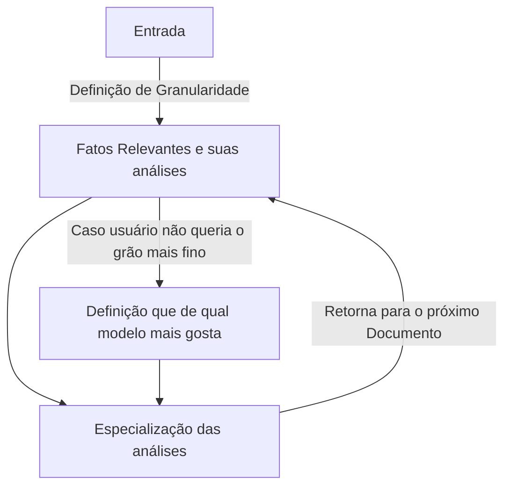

# Crowd-Evaluate

Repositório dedicado para subir uma aplicação Streamlit, que faça o papel de formulário para os usuários que irão ajudar verificar se dados gerados pelos modelos de linguagem são válidos ou não.

Atualmente para executar a aplicação, estou utilizando o uv. Porém, caso não esteja familizarizado, pode utilizar o requirements.txt para isntalar os pacotes.

## Pré-requisitos


### Para enviar e-mail:
- Para fazer o e-mail funcionar, foi utilizado uma funcionalidade do e-mail do google, de gerar uma senha para um app: Onde você encontra / gera essa senha

- Vá em [Minha Conta Google](https://myaccount.google.com/).
- Entre no menu Segurança.
- Ative a Verificação em duas etapas (se ainda não estiver ativa).
- Depois de ativar, aparece a opção Senhas de app.
- Lá você pode criar uma nova, escolher o tipo ("Mail") e o dispositivo ou app.
- O Google gera o código (ex.: abcd efgh ijkl mnop) que você coloca no Python.

⚠️ Importante:

- O Google não mostra novamente a senha depois que ela é criada, então se você não anotou, não tem como recuperar — precisa criar uma nova.
- Esse código não é sua senha principal do Gmail, e só funciona para o app/dispositivo configurado.


### Execução da aplicação local

Localmente:
```bash
# Instalar pacotes necessários
uv sync 
# Ou python -m venv .venv se quiser fazer o uv

# Abrir a venv
source .venv/bin/activate 
# E para instalar pelo pip
# pip install -r requirements.txt

# Rodar aplicação 
streamlit run app.py
```

Alternativa (se quiser fazer sem o uv):
```bash
python -m venv .venv

# Abrir a venv
source .venv/bin/activate 

# E para instalar pelo pip
pip install -r requirements.txt

# Rodar aplicação 
streamlit run app.py
```

### Rodar a aplicação de forma que todos possam acessar.

Porém para fazer algo que seja acessado pelos usuários, dá uma olhada no Streamlit Cloud, siga os passos no seguinte [link](https://streamlit.io/cloud)!

---

## Formato padrão de Execução:




A definição da granularidade é se o usuário quer fazer a versão mais completa do formulário ou a versão mais simples.

Para entender mais sobre a biblioteca do Streamlit que está sendo utilizada aqui, veja esse [vídeo](https://www.youtube.com/watch?v=Ie5ef_R_k6I)!